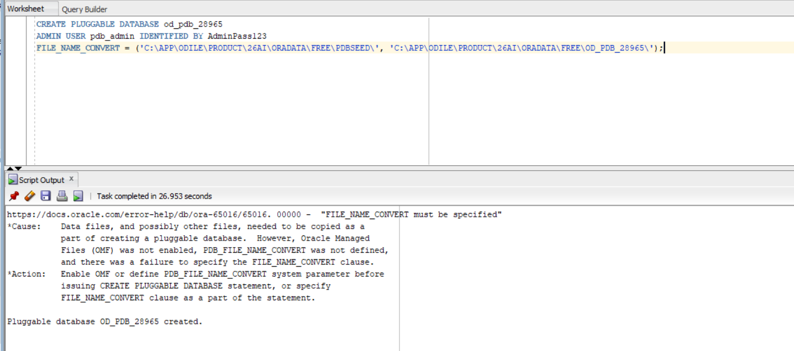
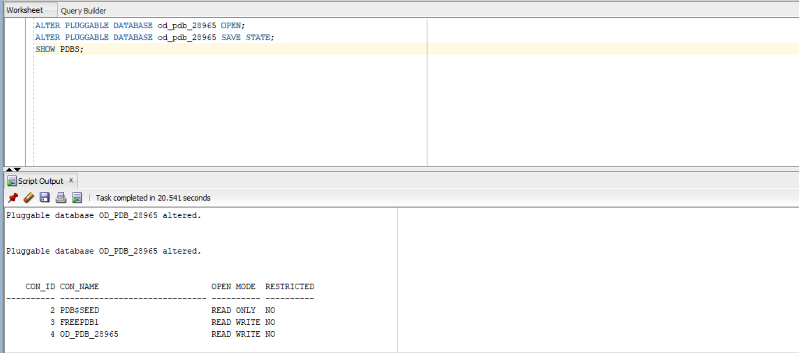
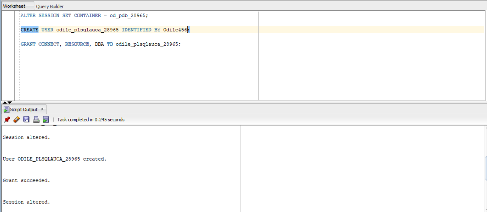
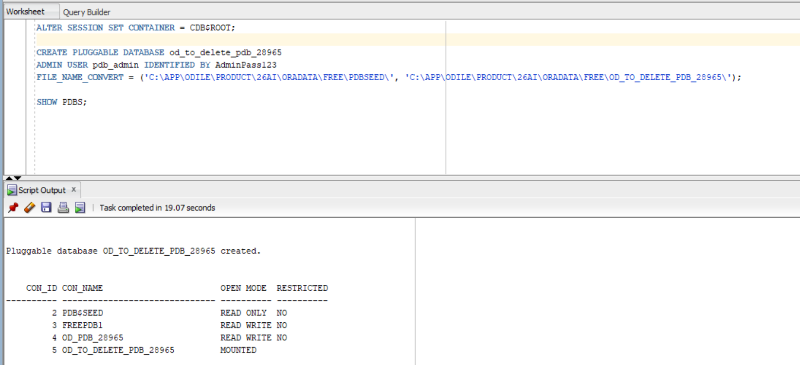
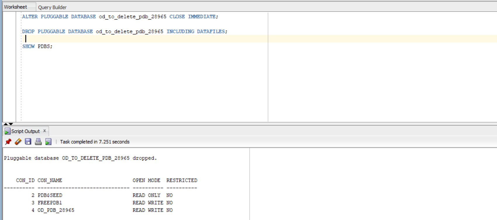
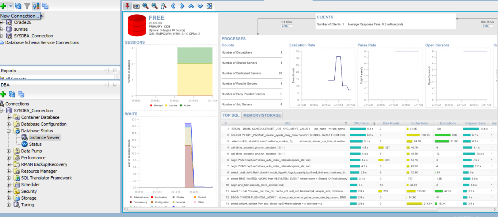

# Oracle Pluggable Databases (PDB) Management Report

**Course:** Database Development with PL/SQL (INSY 8311)  
**Instructor:** Eric Maniraguha  
**Student Name:** IRIHO ODILE  
**Student ID:** 28965  

---

## Submission Details Block

- **Repository Link:** https://github.com/YourGitHubUsername/oracle_pdb_ass_II_28965_odile
- **PDB Name Created:** od_pdb_28965
- **Issues Encountered:** Yes (Resolved ORA-65005 file path syntax issue by specifying explicit Windows database paths for FILE_NAME_CONVERT)

---

## 1. Overview of Tasks

This project covers administrative procedures in Oracle Multitenant Architecture, focusing on:
1. Creating and configuring a permanent Pluggable Database (`od_pdb_28965`) and creating an administrative user (`odile_plsqlauca_28965`).
2. Provisioning, verifying, and completely dropping a temporary Pluggable Database (`od_to_delete_pdb_28965`).
3. Managing and monitoring PDB environment states using SQL Developer DBA Instance Dashboard.

---

## 2. Oracle Environment Used

- **Database Edition:** Oracle Database 26ai / Free Edition
- **Tooling:** Oracle SQL Developer (DBA Instance Viewer)
- **Container Architecture:** Multitenant Container Database (CDB) with Pluggable Databases (PDB)

---

## 3. Explanation of Tasks Executed

### Task 1: Permanent PDB & User Creation
- Executed `CREATE PLUGGABLE DATABASE od_pdb_28965` using local file paths.
- Transitioned the PDB state from `MOUNTED` to `READ WRITE` using `ALTER PLUGGABLE DATABASE OPEN` and persisted the state using `SAVE STATE`.
- Connected to `od_pdb_28965` container and created user `odile_plsqlauca_28965` with `CONNECT`, `RESOURCE`, and `DBA` privileges.

### Task 2: Temporary PDB Provisioning and Deletion
- Created temporary database `od_to_delete_pdb_28965`.
- Verified container existence in `SHOW PDBS;`.
- Closed the temporary PDB and executed `DROP PLUGGABLE DATABASE ... INCLUDING DATAFILES` to clean up all underlying data files completely.

---

## 4. Challenges Faced and Solutions

1. **Challenge:** Encountered error `ORA-65005: missing or invalid file name pattern` when using Linux slash syntax in `FILE_NAME_CONVERT`.
   - *Solution:* Provided explicit Windows directory paths corresponding to local installation directories (`C:\APP\ODILE\PRODUCT\26AI\ORADATA\FREE\`).

---

## 5. Integrity Statement

I declare that this work has been completed individually by me without copying commands, screenshots, or code from classmates or external automated generators, in full accordance with academic integrity guidelines.

---

## 6. Screenshots Evidence

### Task 1: PDB Creation & User Setup

### Task 2: PDB Deletion

### Task 3: OEM / Instance Dashboard

